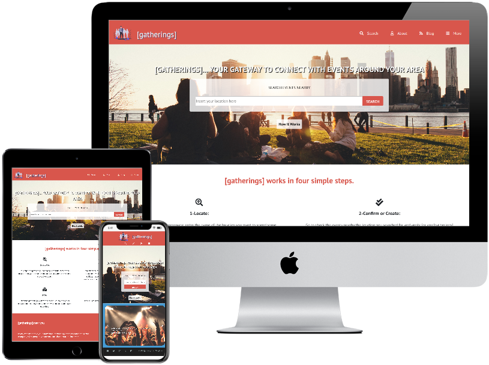
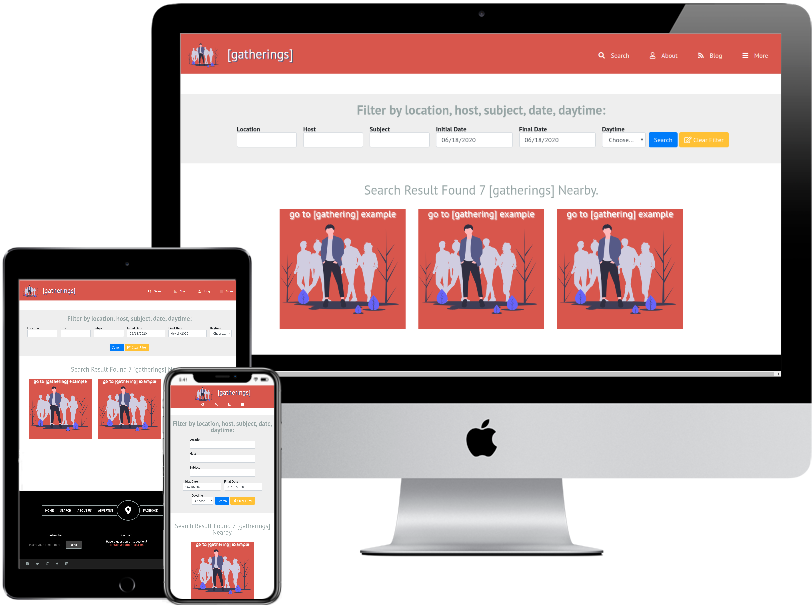

# HTML and CSS capstone project - [gatherings].

>  This is a solo projects at the end of the of the Microverse Main Technical Curriculum of the HTML and CSS section. It's a real-world-like project, built with business specifications to improve and test the achievement of technical and soft skills gained during this section of the program. The main objective was to reproduce the design of The Directory of Schools Webpage inspired by [Mathew Njuguna](https://www.behance.net/gallery/25563385/PatashuleKE) and others on behance, with a different theme. I choose to create a website named [gatherings] where people can meet in real life (after the COVID-19 situation) creating and sharing events across the region desired.

**Main Page**
 

**Search Page**
 

**Details Page**
 

Additional description about the project and its features.

## Built With

- HTML,
- CSS,
- Bootstrap.

## Live Demo

[Live Demo Link](https://rawcdn.githack.com/wrakc/HTML-CSS-Capstone-Project/aa2763438176eb3204cdbff99f2c7ce8296581d4/main.html)

## Video Link Demo

[Video Demo Link](https://www.loom.com/share/53c4b3e00c3540569bc09bcc6dd4b55b)

## Getting Started

**Just access the Live Demo link and check the webpage, you can navigate through the main page, the search page and the details of the search page.**

## Authors

👤 **Carlos Veiga**

- Github: [@githubhandle](https://github.com/wrakc)
- Twitter: [@twitterhandle](https://twitter.com/carlosveig)
- Linkedin: [linkedin](https://linkedin.com/chveiga)

## 🤝 Contributing

Contributions, issues and feature requests are welcome!

Feel free to check the [issues page](issues/).

## Show your support

Give a ⭐️ if you like this project!

## Acknowledgments

- Microverse for the opportunity;
- Design idea by [Mathew Njuguna](https://www.behance.net/mathewnjuguna) and others on Behance;
- [unDraw](https://undraw.co/) for the logo;
- [Stocksnap](https://stocksnap.io/) for the images;
- The Minskins for the support.

## 📝 License

This project is [MIT](LICENSE) licensed.
